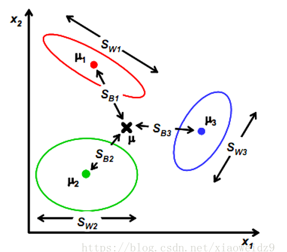

## LDA线性判别分析

### 介绍

LDA 的全称是 Linear Discriminant Analysis (线性判别分析), 是一种 supervised learning. LDA 通常作为数据预处理阶段的降维技术, 经常经过特征提取以后, 我们需要进行降维. LDA 算法既可以用来降维, 又可以用来分类. 

### LDA目标

在对高维样本进行降维后, 我们希望样本在降维后, (1) 同类样本尽量靠近, (2)不同类样本尽量远离. 

采用的方法是, 使用矩阵 $W$ 对原样本进行映射, 之后需要各个类别的均值向量要相互远离 (方差大), 各类别自身的样本要相互靠近, 

### 定义变量

* 全局样本数量为: $m$. 

* 类别数量为: $l$. 
* 各类别样本数量为: $[m_{1}, m_{2}, \cdots , m_{l}]$. 

### 定义全局散度

每个样本用 $x$ 表示: 

$$\begin{aligned} x_{i} \quad i \in [1, m] \end{aligned}$$ 

$x$ 为 $n$ 维向量. 

全局均值为: 

$$\begin{aligned} \mu = & \frac{1}{m} \sum_{i=1}^{m}{x_{i}} \end{aligned}$$ 

全局散度 $S_{t}$ 为: 

$$\begin{aligned} S_{t} = & \sum_{i=1}^{m} (x_{i} - \mu)(x_{i} - \mu)^{\mathsf{T}} \end{aligned}$$ 

即所有样本到全局均值的距离的平方和, 即方差. 

### 定义类内散度

全局散度为所有样的的方差, 类内散度即各类别各自的方差的和. 

各类别各自的均值表示为 $\mu_{c}$: 

$$\begin{aligned} \mu_{c} = & \frac{1}{m_{c}} \sum_{i=1}^{m_{c}}{x_{ci}} \end{aligned}$$ 

类内散度 $S_{w}$, 是各个类别各自, 各向量的方差的和: 

$$\begin{aligned} S_{w}^{c} = \sum_{i=1}^{m_{c}}{(x_{ci} - \mu_{c})(x_{ci} - \mu_{c})^{\mathsf{T}}} \end{aligned}$$ 

$$\begin{aligned} S_{w} = & \sum_{c=1}^{l}{S_{w}^{c}} \\ = & \sum_{c=1}^{l}{\sum_{i=1}^{m_{c}}{(x_{ci} - \mu_{c})(x_{ci} - \mu_{c})^{\mathsf{T}}}} \end{aligned}$$ 

### 定义类间散度

类间散度 $S_{b}$, 是各个类别中心到全局中心的方差和: 

$$\begin{aligned} S_{b} = & S_{t} - S_{w} \\ = & \sum_{i=1}^{m} (x_{i} - \mu)(x_{i} - \mu)^{\mathsf{T}} - \sum_{c=1}^{l}{\sum_{i=1}^{m_{c}}{(x_{ci} - \mu_{c})(x_{ci} - \mu_{c})^{\mathsf{T}}}} \\ = & \sum_{c=1}^{l}{\sum_{i=1}^{m_{c}}} (x_{ci} - \mu)(x_{ci} - \mu)^{\mathsf{T}} - \sum_{c=1}^{l}{\sum_{i=1}^{m_{c}} (x_{ci} - \mu_{c})(x_{ci} - \mu_{c})^{\mathsf{T}}} \\ = & \sum_{c=1}^{l}{\sum_{i=1}^{m_{c}}} \left[ (x_{ci} - \mu)(x_{ci} - \mu)^{\mathsf{T}} - (x_{ci} - \mu_{c})(x_{ci} - \mu_{c})^{\mathsf{T}} \right] \\ = & \sum_{c=1}^{l}{\sum_{i=1}^{m_{c}}} \left[ (x_{ci} x_{ci}^{\mathsf{T}} - x_{ci} \mu^{\mathsf{T}} - \mu x_{ci}^{\mathsf{T}} + \mu \mu^{\mathsf{T}}) - (x_{ci} x_{ci}^{\mathsf{T}} - x_{ci} \mu_{c}^{\mathsf{T}} - \mu_{c} x_{ci}^{\mathsf{T}} + \mu_{c} \mu_{c}^{\mathsf{T}}) \right] \\ = & \sum_{c=1}^{l}{\sum_{i=1}^{m_{c}}} \left[ x_{ci} x_{ci}^{\mathsf{T}} - x_{ci} \mu^{\mathsf{T}} - \mu x_{ci}^{\mathsf{T}} + \mu \mu^{\mathsf{T}} - x_{ci} x_{ci}^{\mathsf{T}} + x_{ci} \mu_{c}^{\mathsf{T}} + \mu_{c} x_{ci}^{\mathsf{T}} - \mu_{c} \mu_{c}^{\mathsf{T}} \right] \\ = & \sum_{c=1}^{l}{\sum_{i=1}^{m_{c}}} \left[ - x_{ci} \mu^{\mathsf{T}} - \mu x_{ci}^{\mathsf{T}} + \mu \mu^{\mathsf{T}} + x_{ci} \mu_{c}^{\mathsf{T}} + \mu_{c} x_{ci}^{\mathsf{T}} - \mu_{c} \mu_{c}^{\mathsf{T}} \right] \\ = & \sum_{c=1}^{l}{\sum_{i=1}^{m_{c}}} \left[ x_{ci}(\mu_{c}^{\mathsf{T}} - \mu^{\mathsf{T}}) + (\mu_{c} - \mu) x_{ci}^{\mathsf{T}} + (\mu \mu^{\mathsf{T}} - \mu_{c} \mu_{c}^{\mathsf{T}}) \right] \\ = & \sum_{c=1}^{l} \left[ (\sum_{i=1}^{m_{c}}x_{ci})(\mu_{c}^{\mathsf{T}} - \mu^{\mathsf{T}}) + (\mu_{c} - \mu) (\sum_{i=1}^{m_{c}} x_{ci}^{\mathsf{T}}) + \sum_{i=1}^{m_{c}}(\mu \mu^{\mathsf{T}} - \mu_{c} \mu_{c}^{\mathsf{T}}) \right] \\ = & \sum_{c=1}^{l} \left[ m_{c}\mu_{c}(\mu_{c}^{\mathsf{T}} - \mu^{\mathsf{T}}) + (\mu_{c} - \mu) m_{c} \mu_{c}^{\mathsf{T}} + m_{c}(\mu \mu^{\mathsf{T}} - \mu_{c} \mu_{c}^{\mathsf{T}}) \right] \\ = & \sum_{c=1}^{l} m_{c} \left[ \mu_{c}(\mu_{c}^{\mathsf{T}} - \mu^{\mathsf{T}}) + (\mu_{c} - \mu) \mu_{c}^{\mathsf{T}} + (\mu \mu^{\mathsf{T}} - \mu_{c} \mu_{c}^{\mathsf{T}}) \right] \\ = & \sum_{c=1}^{l} m_{c} \left[ (\mu_{c} \mu_{c}^{\mathsf{T}} - \mu_{c} \mu^{\mathsf{T}}) + (\mu_{c} \mu_{c}^{\mathsf{T}} - \mu \mu_{c}^{\mathsf{T}}) + (\mu \mu^{\mathsf{T}} - \mu_{c} \mu_{c}^{\mathsf{T}}) \right] \\ = & \sum_{c=1}^{l} m_{c} ( \mu_{c} \mu_{c}^{\mathsf{T}} - \mu_{c} \mu^{\mathsf{T}} + \mu_{c} \mu_{c}^{\mathsf{T}} - \mu \mu_{c}^{\mathsf{T}} + \mu \mu^{\mathsf{T}} - \mu_{c} \mu_{c}^{\mathsf{T}} ) \\ = & \sum_{c=1}^{l} m_{c} ( - \mu_{c} \mu^{\mathsf{T}} + \mu_{c} \mu_{c}^{\mathsf{T}} - \mu \mu_{c}^{\mathsf{T}} + \mu \mu^{\mathsf{T}} ) \\ = & \sum_{c=1}^{l} m_{c} \left[ (\mu_{c} - \mu)(\mu_{c}^{\mathsf{T}} - \mu^{\mathsf{T}}) \right] \\ = & \sum_{c=1}^{l} m_{c} \left[ (\mu_{c} - \mu)(\mu_{c} - \mu)^{\mathsf{T}} \right] \end{aligned}$$ 

即: 

$$\begin{aligned} S_{b} = & S_{t} - S_{w} \\ = & \sum_{c=1}^{l} m_{c} \left[ (\mu_{c} - \mu)(\mu_{c} - \mu)^{\mathsf{T}} \right] \end{aligned}$$ 

上式可以看出, $S_{b}$ 是各类别均值到全局均值和距离的平方, 再分别乘以各类别的样本数量. 

即, 全局散度相对更大, 类内散度相对更小. 

### LDA 的优化目标

LDA 的优化目标是, **最大化类间散度 $S_{b}$, 最小化类内散度 $S_{w}$**. 

#### 类内散度

现假设, 我们将 $n$ 维样本映射到一维的空间中. 即 $W$ 是 $n$ 行 $1$ 列的向量. 

$$\begin{aligned} \widetilde{S}_{w} = & \sum_{c=1}^{l}{\sum_{i=1}^{m_{c}}{(x_{ci}W - \mu_{c}W)(x_{ci}W - \mu_{c}W)^{\mathsf{T}}}} \end{aligned}$$ 

$$\begin{aligned}\widetilde{S}_{w}^{c} = & \sum_{i=1}^{m_{c}}{(x_{ci}W - \mu_{c}W)(x_{ci}W - \mu_{c}W)^{\mathsf{T}}} \\ = & \left[ \begin{matrix} w_{11} & w_{12} & \cdots & w_{1n} \end{matrix} \right] \left[ \begin{matrix} x_{11}^{c} - \mu_{1}^{c} & x_{21}^{c} - \mu_{1}^{c} & \cdots & x_{m_{c}1}^{c} - \mu_{1}^{c} \\ x_{12}^{c} - \mu_{2}^{c} & x_{22}^{c} - \mu_{2}^{c} & \cdots & x_{m_{c}2}^{c} - \mu_{2}^{c} \\ \cdots & \cdots & \cdots & \cdots \\ x_{1n}^{c} - \mu_{n}^{c} & x_{2n}^{c} - \mu_{n}^{c} & \cdots & x_{m_{c}n}^{c} - \mu_{n}^{c} \end{matrix} \right] \left[ \begin{matrix} x_{11}^{c} - \mu_{1}^{c} & x_{12}^{c} - \mu_{2}^{c} & \cdots & x_{1n}^{c} - \mu_{n}^{c} \\ x_{21}^{c} - \mu_{1}^{c} & x_{22}^{c} - \mu_{2}^{c} & \cdots & x_{2n}^{c} - \mu_{n}^{c} \\ \cdots & \cdots & \cdots & \cdots \\ x_{m_{c}1}^{c} - \mu_{1}^{c} & x_{m_{c}2}^{c} - \mu_{2}^{c} & \cdots & x_{m_{c}n}^{c} - \mu_{n}^{c} \end{matrix} \right] \left[ \begin{matrix} w_{11} \\ w_{12} \\ \cdots \\ w_{1n} \end{matrix} \right]  \end{aligned}$$ 

#### 类间散度

现假设, 我们将 $n$ 维样本映射到一维的空间中. 即 $W$ 是 $n$ 行 $1$ 列的向量. 

$$\begin{aligned} \widetilde{S}_{b} = & \sum_{c=1}^{l} m_{c} [(\mu_{c} W - \mu W)(\mu_{c} W - \mu W)^{\mathsf{T}}] \\ = &  \left[ \begin{matrix} w_{11} & w_{12} & \cdots & w_{1n} \end{matrix} \right] \left[ \begin{matrix} \mu_{1}^{1} - \mu_{1} & \mu_{1}^{2} - \mu_{1} & \cdots & \mu_{1}^{l} - \mu_{1} \\ \mu_{2}^{1} - \mu_{2} & \mu_{2}^{2} - \mu_{2} & \cdots & \mu_{2}^{l} - \mu_{2} \\ \cdots & \cdots & \cdots & \cdots \\ \mu_{n}^{1} - \mu_{n} & \mu_{n}^{2} - \mu_{n} & \cdots & \mu_{n}^{l} - \mu_{n} \end{matrix} \right]_{n \times l} \left[ \begin{matrix} m_{1} & 0 & \cdots & 0 \\ 0 & m_{2} & 0 & 0 \\ \cdots & \cdots & \cdots & \cdots \\ 0 & 0 & 0 & m_{l} \end{matrix} \right] \left[ \begin{matrix} \mu_{1}^{1} - \mu_{1} & \mu_{2}^{1} - \mu_{2} & \cdots & \mu_{n}^{1} - \mu_{n} \\ \mu_{1}^{2} - \mu_{1} & \mu_{2}^{2} - \mu_{2} & \cdots & \mu_{n}^{2} - \mu_{n} \\ \cdots & \cdots & \cdots & \cdots \\ \mu_{1}^{l} - \mu_{1} & \mu_{2}^{l} - \mu_{2} & \cdots & \mu_{n}^{l} - \mu_{n} \end{matrix} \right]_{l \times n} \left[ \begin{matrix} w_{11} \\ w_{12} \\ \cdots \\ w_{1n} \end{matrix} \right] \end{aligned}$$ 

#### 优化目标

最大化: $$\begin{aligned} \frac{\widetilde{S}_{b}}{\widetilde{S}_{w}} \end{aligned}$$ . 令: $$\begin{aligned} \widetilde{S}_{w} = 1 \end{aligned}$$ . 

采用拉格朗日乘子法 ($\lambda$ 是常数, 加与减没有影响), 即最大化: 

$$\begin{aligned} L(W, \lambda) = & \widetilde{S}_{b} - \lambda (\widetilde{S}_{w} - 1) \\ = & \widetilde{S}_{b} - \lambda \widetilde{S}_{w} + \lambda \end{aligned}$$ 

$$\begin{aligned} \frac{\partial{\widetilde{S}_{b}}}{\partial{W}} = 2 \times \left[ \begin{matrix} \mu_{1}^{1} - \mu_{1} & \mu_{1}^{2} - \mu_{1} & \cdots & \mu_{1}^{l} - \mu_{1} \\ \mu_{2}^{1} - \mu_{2} & \mu_{2}^{2} - \mu_{2} & \cdots & \mu_{2}^{l} - \mu_{2} \\ \cdots & \cdots & \cdots & \cdots \\ \mu_{n}^{1} - \mu_{n} & \mu_{n}^{2} - \mu_{n} & \cdots & \mu_{n}^{l} - \mu_{n} \end{matrix} \right]_{n \times l} \left[ \begin{matrix} m_{1} & 0 & \cdots & 0 \\ 0 & m_{2} & 0 & 0 \\ \cdots & \cdots & \cdots & \cdots \\ 0 & 0 & 0 & m_{l} \end{matrix} \right] \left[ \begin{matrix} \mu_{1}^{1} - \mu_{1} & \mu_{2}^{1} - \mu_{2} & \cdots & \mu_{n}^{1} - \mu_{n} \\ \mu_{1}^{2} - \mu_{1} & \mu_{2}^{2} - \mu_{2} & \cdots & \mu_{n}^{2} - \mu_{n} \\ \cdots & \cdots & \cdots & \cdots \\ \mu_{1}^{l} - \mu_{1} & \mu_{2}^{l} - \mu_{2} & \cdots & \mu_{n}^{l} - \mu_{n} \end{matrix} \right]_{l \times n} \left[ \begin{matrix} w_{11} \\ w_{12} \\ \cdots \\ w_{1n} \end{matrix} \right] \end{aligned}$$ 

$$\begin{aligned} \frac{\partial{\widetilde{S}_{w}^{c}}}{\partial{W}} = 2 \times \left[ \begin{matrix} x_{11}^{c} - \mu_{1}^{c} & x_{21}^{c} - \mu_{1}^{c} & \cdots & x_{m_{c}1}^{c} - \mu_{1}^{c} \\ x_{12}^{c} - \mu_{2}^{c} & x_{22}^{c} - \mu_{2}^{c} & \cdots & x_{m_{c}2}^{c} - \mu_{2}^{c} \\ \cdots & \cdots & \cdots & \cdots \\ x_{1n}^{c} - \mu_{n}^{c} & x_{2n}^{c} - \mu_{n}^{c} & \cdots & x_{m_{c}n}^{c} - \mu_{n}^{c} \end{matrix} \right] \left[ \begin{matrix} x_{11}^{c} - \mu_{1}^{c} & x_{12}^{c} - \mu_{2}^{c} & \cdots & x_{1n}^{c} - \mu_{n}^{c} \\ x_{21}^{c} - \mu_{1}^{c} & x_{22}^{c} - \mu_{2}^{c} & \cdots & x_{2n}^{c} - \mu_{n}^{c} \\ \cdots & \cdots & \cdots & \cdots \\ x_{m_{c}1}^{c} - \mu_{1}^{c} & x_{m_{c}2}^{c} - \mu_{2}^{c} & \cdots & x_{m_{c}n}^{c} - \mu_{n}^{c} \end{matrix} \right] \left[ \begin{matrix} w_{11} \\ w_{12} \\ \cdots \\ w_{1n} \end{matrix} \right] \end{aligned}$$ 

$$\begin{aligned} \frac{\partial{L}}{\partial{W}} = & \frac{\partial{\widetilde{S}_{b}}}{\partial{W}} - \lambda \sum_{c=1}^{l} \frac{\partial{\widetilde{S}_{w}^{c}}}{\partial{W}} \\ = & 2 (\Mu - \mu)^{\mathsf{T}} \text{diag}(m) (\Mu - \mu) W - \lambda \sum_{c=1}^{l} 2 (X_{c} - \mu_{c})^{\mathsf{T}} (X_{c} - \mu_{c}) W \end{aligned}$$ 

令: 

$$\begin{aligned} \frac{\partial{L}}{\partial{W}} = 0 \end{aligned}$$ 

即: 

$$\begin{aligned} (\Mu - \mu)^{\mathsf{T}} \text{diag}(m) (\Mu - \mu) W = & \lambda \sum_{c=1}^{l} (X_{c} - \mu_{c})^{\mathsf{T}} (X_{c} - \mu_{c}) W \\ (\Mu - \mu)^{\mathsf{T}} \text{diag}(m) (\Mu - \mu) W = & \lambda \sum_{c=1}^{l} (X_{c} - \mu_{c})^{\mathsf{T}} (X_{c} - \mu_{c}) W \\ [ \sum_{c=1}^{l} (X_{c} - \mu_{c})^{\mathsf{T}} (X_{c} - \mu_{c})]^{-1} \cdot [(\Mu - \mu)^{\mathsf{T}} \text{diag}(m) (\Mu - \mu)] W = & \lambda W \\ (\sum_{c=1}^{l}{S_{w}^{c}})^{-1} \cdot [(\Mu - \mu)^{\mathsf{T}} \text{diag}(m) (\Mu - \mu)] W = & \lambda W \\ S_{w}^{-1} \cdot [(\Mu - \mu)^{\mathsf{T}} \text{diag}(m) (\Mu - \mu)] W = & \lambda W \\ S_{w}^{-1} \cdot \left\{ \sum_{c=1}^{l} m_{c} \left[ (\mu_{c} - \mu)(\mu_{c} - \mu)^{\mathsf{T}} \right] \right\} W = & \lambda W \\ S_{w}^{-1} \cdot S_{b} W = & \lambda W \\ [S_{w}^{-1} \cdot S_{b}] W = & \lambda W \end{aligned}$$ 

即: 特征值分解 $Ax = \lambda x$. 

