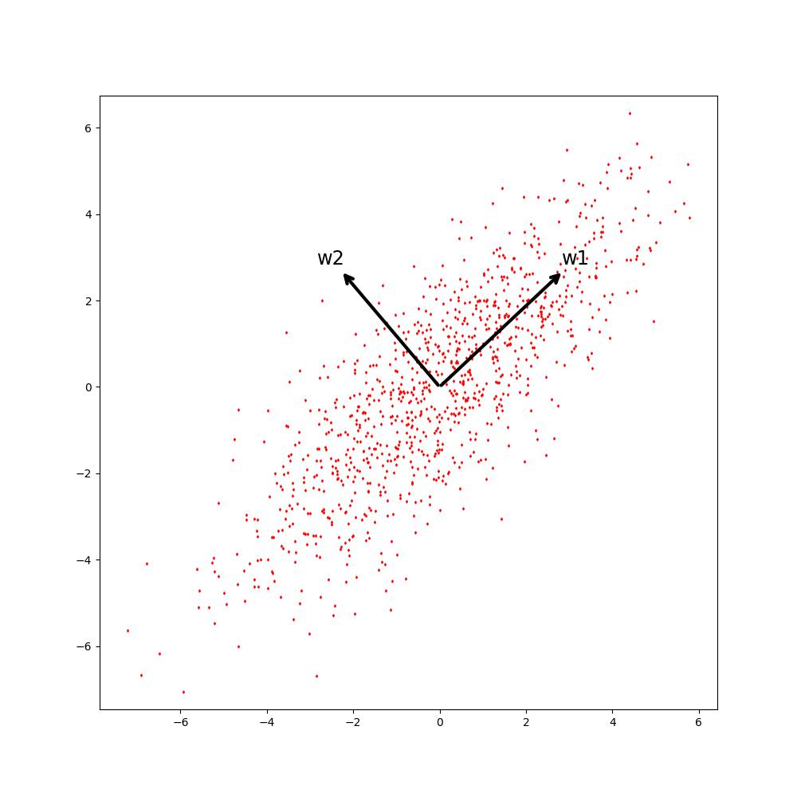

## PCA主成分分析

### 简介

Principal Components Analysis (PCA) 指的是一种数据处理方法, 它是一种无监督学习算法, 用于分析和重构复杂的高维数据集, 使其更容易理解, 并提取更重要的信息和特征. PCA 不仅可以用于统计分析, 而且在建模等领域也有很多用途. PCA 有把高维数据集转换成更低维度的特征, 还有降低数据量和复杂度以及去除数据冗余的功能. 

### 推导

如下图中的样本点, 我们想找到 $w_{1}$, $w_{2}$ 的基向量, 使得样本映射到该基向量后, 在其中 $w_{1}$ 上的分散程度最大, 这样就可以只取 $w_{1}$ 的特征作为样本描述, 以达到数据降维的效果. 

公式化推导: 

设 $m$ 个 $n$ 维的数据样本 $X_{m \times n}$ (默认其已经过 "中心化" 处理, 即 $\sum_{i=1}^{m}{X_{i}=0}$), 求一个 $n$ 维单位向量 $W_{n \times 1}$, 使 $X_{m \times n}$ 投影到该向量后, 方差最大 (最为分散). 

$$\begin{aligned} \Sigma =& W_{1 \times n}^{\mathsf{T}} X_{m \times n}^{\mathsf{T}} X_{m \times n} W_{n \times 1} \\ =& \left[ \begin{matrix} w_{1} & w_{2} & \cdots & w_{n} \end{matrix} \right] \cdot \left[ \begin{matrix} x_{11} & x_{21} & \cdots & x_{m1} \\ x_{12} & x_{22} & \cdots & x_{m2} \\ \cdots & \cdots & \cdots & \cdots \\ x_{1n} & x_{2n} & \cdots & x_{mn} \end{matrix} \right] \cdot \left[ \begin{matrix} x_{11} & x_{12} & \cdots & x_{1n} \\ x_{21} & x_{22} & \cdots & x_{2n} \\ \cdots & \cdots & \cdots & \cdots \\ x_{m1} & x_{m2} & \cdots & x_{mn} \end{matrix} \right] \cdot \left[ \begin{matrix} w_{1} \\ w_{2} \\ \cdots \\ w_{n} \end{matrix} \right] \\ = & \left[ \begin{matrix} w_{1} & w_{2} & \cdots & w_{n} \end{matrix} \right] \cdot \left[ \begin{matrix} x_{11} & x_{21} & \cdots & x_{m1} \\ x_{12} & x_{22} & \cdots & x_{m2} \\ \cdots & \cdots & \cdots & \cdots \\ x_{1n} & x_{2n} & \cdots & x_{mn} \end{matrix} \right] \cdot \left[ \begin{matrix} \sum_{i=1}^{n}{w_{i}x_{1i}} \\ \sum_{i=1}^{n}{w_{i}x_{2i}} \\ \cdots \\ \sum_{i=1}^{n}{w_{i}x_{mi}} \end{matrix} \right] \\ = & \left[ \begin{matrix} w_{1} & w_{2} & \cdots & w_{n} \end{matrix} \right] \cdot \left[ \begin{matrix} x_{11}\sum_{i=1}^{n}{w_{i}x_{1i}} + x_{21}\sum_{i=1}^{n}{w_{i}x_{2i}} + \cdots + x_{m1}\sum_{i=1}^{n}{w_{i}x_{mi}} \\ x_{12}\sum_{i=1}^{n}{w_{i}x_{1i}} + x_{22}\sum_{i=1}^{n}{w_{i}x_{2i}} + \cdots + x_{m2}\sum_{i=1}^{n}{w_{i}x_{mi}} \\ \cdots \\ x_{1n}\sum_{i=1}^{n}{w_{i}x_{1i}} + x_{2n}\sum_{i=1}^{n}{w_{i}x_{2i}} + \cdots + x_{mn}\sum_{i=1}^{n}{w_{i}x_{mi}} \end{matrix} \right] \\ = & \left[ \begin{matrix} w_{1} & w_{2} & \cdots & w_{n} \end{matrix} \right] \cdot \left[ \begin{matrix} \sum_{j=1}^{m}(x_{j1}\sum_{i=1}^{n}{w_{i}x_{ji}}) \\  \sum_{j=1}^{m}(x_{j2}\sum_{i=1}^{n}{w_{i}x_{ji}}) \\ \cdots \\ \sum_{j=1}^{m}(x_{jn}\sum_{i=1}^{n}{w_{i}x_{ji}}) \end{matrix} \right] \\ = & w_{1}\sum_{j=1}^{m}(x_{j1}\sum_{i=1}^{n}{w_{i}x_{ji}}) + w_{2}\sum_{j=1}^{m}(x_{j2}\sum_{i=1}^{n}{w_{i}x_{ji}}) + \cdots + w_{n}\sum_{j=1}^{m}(x_{jn}\sum_{i=1}^{n}{w_{i}x_{ji}}) \\ = &  \sum_{k=1}^{n}(w_{k}\sum_{j=1}^{m}(x_{jk}\sum_{i=1}^{n}{w_{i}x_{ji}})) \\ = & \left[ \begin{matrix} \sum_{i=1}^{n}{w_{i}x_{1i}} & \sum_{i=1}^{n}{w_{i}x_{2i}} & \cdots & \sum_{i=1}^{n}{w_{i}x_{mi}} \end{matrix} \right] \cdot \left[ \begin{matrix} \sum_{i=1}^{n}{w_{i}x_{1i}} \\ \sum_{i=1}^{n}{w_{i}x_{2i}} \\ \cdots \\ \sum_{i=1}^{n}{w_{i}x_{mi}} \end{matrix} \right] \\ = & (\sum_{i=1}^{n}{w_{i}x_{1i}})^{2} + (\sum_{i=1}^{n}{w_{i}x_{2i}})^{2} + \cdots + (\sum_{i=1}^{n}{w_{i}x_{mi}})^{2}  \end{aligned}$$ 

其中: $W_{n \times 1}$ 是单位向量. 

$$\begin{aligned} \Sigma = & \sum_{k=1}^{n}(w_{k}\sum_{j=1}^{m}(x_{jk}\sum_{i=1}^{n}{w_{i}x_{ji}})) \\ 0 = & 1 - \sum_{i=1}^{n}{w_{i}^{2}} \end{aligned}$$ 

拉格朗日乘子法求 $\Sigma$ 的最大值. 

$$\begin{aligned} F(w_{1}, w_{2}, \cdots, w_{n}, \lambda) = \Sigma + \lambda (1 - \sum_{i=1}^{n}{w_{i}^{2}}) \end{aligned}$$ 

求导: 

$$\begin{aligned} \frac{\partial{F}}{\partial{w_{i}}} = & \frac{\partial{\Sigma}}{\partial{w_{i}}} - 2 \lambda w_{i} \quad i \in [1, n] \\ \frac{\partial{F}}{\partial{\lambda}} =& 1 - \sum_{i=1}^{n}{w_{i}^{2}} \end{aligned}$$ 

从 $\frac{\partial{F}}{\partial{w_{i}}} = \frac{\partial{\Sigma}}{\partial{w_{i}}} - 2 \lambda w_{i} = 0$ 求 $\lambda$. 

令 $w_{i} = w_{1}$: 

有: 

$$\begin{aligned} \frac{\partial{(w_{1}\sum_{j=1}^{m}(x_{j1}\sum_{i=1}^{n}{w_{i}x_{ji}}))}}{\partial{w_{1}}} = & \sum_{j=1}^{m}(x_{j1}\sum_{i=1}^{n}{w_{i}x_{ji}}) + w_{1}(x_{11}x_{11} + x_{21}x_{21} + \cdots + x_{m1}x_{m1}) \\ = & \sum_{j=1}^{m}(x_{j1}\sum_{i=1}^{n}{w_{i}x_{ji}}) + w_{1}\sum_{i=1}^{m}{x_{i1}x_{i1}} \end{aligned}$$ 

$$\begin{aligned} \frac{\partial{(w_{2}\sum_{j=1}^{m}(x_{j2}\sum_{i=1}^{n}{w_{i}x_{ji}}))}}{\partial{w_{1}}} = & w_{2}(x_{12}x_{11} + x_{22}x_{21} + \cdots + x_{m2}x_{m1}) \\ = & w_{2} \sum_{i=1}^{m}{x_{i2}x_{i1}} \end{aligned}$$ 

$$\begin{aligned} \frac{\partial{(w_{n}\sum_{j=1}^{m}(x_{jn}\sum_{i=1}^{n}{w_{i}x_{ji}}))}}{\partial{w_{1}}} = & w_{n}(x_{1n}x_{11} + x_{2n}x_{21} + \cdots + x_{mn}x_{m1}) \\ = & w_{n} \sum_{i=1}^{m}{x_{in}x_{i1}} \end{aligned}$$ 

因此有: 

$$\begin{aligned} \frac{\partial{\Sigma}}{\partial{w_{1}}} = & \frac{\partial{(w_{1}\sum_{j=1}^{m}(x_{j1}\sum_{i=1}^{n}{w_{i}x_{ji}}) + w_{2}\sum_{j=1}^{m}(x_{j2}\sum_{i=1}^{n}{w_{i}x_{ji}}) + \cdots + w_{n}\sum_{j=1}^{m}(x_{jn}\sum_{i=1}^{n}{w_{i}x_{ji}}))}}{\partial{w_{1}}} \\ = & \frac{\partial{(w_{1}\sum_{j=1}^{m}(x_{j1}\sum_{i=1}^{n}{w_{i}x_{ji}}))}}{\partial{w_{1}}} + \frac{\partial{(w_{2}\sum_{j=1}^{m}(x_{j2}\sum_{i=1}^{n}{w_{i}x_{ji}}))}}{\partial{w_{1}}} + \cdots + \frac{\partial{(w_{n}\sum_{j=1}^{m}(x_{jn}\sum_{i=1}^{n}{w_{i}x_{ji}})))}}{\partial{w_{1}}} \\ = & \sum_{j=1}^{m}(x_{j1}\sum_{i=1}^{n}{w_{i}x_{ji}}) + w_{1}\sum_{i=1}^{m}{x_{i1}x_{i1}} + w_{2} \sum_{i=1}^{m}{x_{i2}x_{i1}} + \cdots + w_{n} \sum_{i=1}^{m}{x_{in}x_{i1}} \\ = & \sum_{j=1}^{m}(x_{j1}\sum_{i=1}^{n}{w_{i}x_{ji}}) + \sum_{j=1}^{n}{(w_{j} \sum_{i=1}^{m}{x_{ij}x_{i1}})} \\ = & \left[ \begin{matrix} x_{11} & x_{21} & \cdots & x_{m1} \end{matrix} \right] \cdot \left[ \begin{matrix} x_{11} & x_{12} & \cdots & x_{1n} \\ x_{21} & x_{22} & \cdots & x_{2n} \\ \cdots & \cdots & \cdots & \cdots \\ x_{m1} & x_{m2} & \cdots & x_{mn} \end{matrix} \right] \cdot \left[ \begin{matrix} w_{1} \\ w_{2} \\ \cdots \\ w_{n} \end{matrix} \right] + \left[ \begin{matrix} w_{1} & w_{2} & \cdots & w_{n} \end{matrix} \right] \cdot \left[ \begin{matrix} x_{11} & x_{21} & \cdots & x_{m1} \\ x_{12} & x_{22} & \cdots & x_{m2} \\ \cdots & \cdots & \cdots & \cdots \\ x_{1n} & x_{2n} & \cdots & x_{mn} \end{matrix} \right] \cdot \left[ \begin{matrix} x_{11} \\ x_{21} \\ \cdots \\ x_{m1} \end{matrix} \right] \\ = & 2 \times \left[ \begin{matrix} x_{11} & x_{21} & \cdots & x_{m1} \end{matrix} \right] \cdot \left[ \begin{matrix} x_{11} & x_{12} & \cdots & x_{1n} \\ x_{21} & x_{22} & \cdots & x_{2n} \\ \cdots & \cdots & \cdots & \cdots \\ x_{m1} & x_{m2} & \cdots & x_{mn} \end{matrix} \right] \cdot \left[ \begin{matrix} w_{1} \\ w_{2} \\ \cdots \\ w_{n} \end{matrix} \right]  \end{aligned}$$ 

$$\begin{aligned} \frac{\partial{\Sigma}}{\partial{w_{2}}} = & \frac{\partial{(w_{1}\sum_{j=1}^{m}(x_{j1}\sum_{i=1}^{n}{w_{i}x_{ji}}) + w_{2}\sum_{j=1}^{m}(x_{j2}\sum_{i=1}^{n}{w_{i}x_{ji}}) + \cdots + w_{n}\sum_{j=1}^{m}(x_{jn}\sum_{i=1}^{n}{w_{i}x_{ji}}))}}{\partial{w_{2}}} \\ = & \frac{\partial{(w_{1}\sum_{j=1}^{m}(x_{j1}\sum_{i=1}^{n}{w_{i}x_{ji}}))}}{\partial{w_{2}}} + \frac{\partial{(w_{2}\sum_{j=1}^{m}(x_{j2}\sum_{i=1}^{n}{w_{i}x_{ji}}))}}{\partial{w_{2}}} + \cdots + \frac{\partial{(w_{n}\sum_{j=1}^{m}(x_{jn}\sum_{i=1}^{n}{w_{i}x_{ji}})))}}{\partial{w_{2}}} \\ = & \sum_{j=1}^{m}(x_{j2}\sum_{i=1}^{n}{w_{i}x_{ji}}) + w_{1}\sum_{i=1}^{m}{x_{i1}x_{i2}} + w_{2} \sum_{i=1}^{m}{x_{i2}x_{i2}} + \cdots + w_{n} \sum_{i=1}^{m}{x_{in}x_{i2}} \\ = & \sum_{j=1}^{m}(x_{j2}\sum_{i=1}^{n}{w_{i}x_{ji}}) + \sum_{j=1}^{n}{(w_{j} \sum_{i=1}^{m}{x_{ij}x_{i2}})} \\ = & \left[ \begin{matrix} x_{12} & x_{22} & \cdots & x_{m2} \end{matrix} \right] \cdot \left[ \begin{matrix} x_{11} & x_{12} & \cdots & x_{1n} \\ x_{21} & x_{22} & \cdots & x_{2n} \\ \cdots & \cdots & \cdots & \cdots \\ x_{m1} & x_{m2} & \cdots & x_{mn} \end{matrix} \right] \cdot \left[ \begin{matrix} w_{1} \\ w_{2} \\ \cdots \\ w_{n} \end{matrix} \right] + \left[ \begin{matrix} w_{1} & w_{2} & \cdots & w_{n} \end{matrix} \right] \cdot \left[ \begin{matrix} x_{11} & x_{21} & \cdots & x_{m1} \\ x_{12} & x_{22} & \cdots & x_{m2} \\ \cdots & \cdots & \cdots & \cdots \\ x_{1n} & x_{2n} & \cdots & x_{mn} \end{matrix} \right] \cdot \left[ \begin{matrix} x_{12} \\ x_{22} \\ \cdots \\ x_{m2} \end{matrix} \right] \\ = & 2 \times \left[ \begin{matrix} x_{12} & x_{22} & \cdots & x_{m2} \end{matrix} \right] \cdot \left[ \begin{matrix} x_{11} & x_{12} & \cdots & x_{1n} \\ x_{21} & x_{22} & \cdots & x_{2n} \\ \cdots & \cdots & \cdots & \cdots \\ x_{m1} & x_{m2} & \cdots & x_{mn} \end{matrix} \right] \cdot \left[ \begin{matrix} w_{1} \\ w_{2} \\ \cdots \\ w_{n} \end{matrix} \right]  \end{aligned}$$ 

$$\begin{aligned} \frac{\partial{\Sigma}}{\partial{w_{n}}} = & \frac{\partial{(w_{1}\sum_{j=1}^{m}(x_{j1}\sum_{i=1}^{n}{w_{i}x_{ji}}) + w_{2}\sum_{j=1}^{m}(x_{j2}\sum_{i=1}^{n}{w_{i}x_{ji}}) + \cdots + w_{n}\sum_{j=1}^{m}(x_{jn}\sum_{i=1}^{n}{w_{i}x_{ji}}))}}{\partial{w_{n}}} \\ = & \frac{\partial{(w_{1}\sum_{j=1}^{m}(x_{j1}\sum_{i=1}^{n}{w_{i}x_{ji}}))}}{\partial{w_{n}}} + \frac{\partial{(w_{2}\sum_{j=1}^{m}(x_{j2}\sum_{i=1}^{n}{w_{i}x_{ji}}))}}{\partial{w_{n}}} + \cdots + \frac{\partial{(w_{n}\sum_{j=1}^{m}(x_{jn}\sum_{i=1}^{n}{w_{i}x_{ji}})))}}{\partial{w_{n}}} \\ = & \sum_{j=1}^{m}(x_{jn}\sum_{i=1}^{n}{w_{i}x_{ji}}) + w_{1}\sum_{i=1}^{m}{x_{i1}x_{in}} + w_{2} \sum_{i=1}^{m}{x_{i2}x_{in}} + \cdots + w_{n} \sum_{i=1}^{m}{x_{in}x_{in}} \\ = & \sum_{j=1}^{m}(x_{jn}\sum_{i=1}^{n}{w_{i}x_{ji}}) + \sum_{j=1}^{n}{(w_{j} \sum_{i=1}^{m}{x_{ij}x_{in}})} \\ = & \left[ \begin{matrix} x_{1n} & x_{2n} & \cdots & x_{mn} \end{matrix} \right] \cdot \left[ \begin{matrix} x_{11} & x_{12} & \cdots & x_{1n} \\ x_{21} & x_{22} & \cdots & x_{2n} \\ \cdots & \cdots & \cdots & \cdots \\ x_{m1} & x_{m2} & \cdots & x_{mn} \end{matrix} \right] \cdot \left[ \begin{matrix} w_{1} \\ w_{2} \\ \cdots \\ w_{n} \end{matrix} \right] + \left[ \begin{matrix} w_{1} & w_{2} & \cdots & w_{n} \end{matrix} \right] \cdot \left[ \begin{matrix} x_{11} & x_{21} & \cdots & x_{m1} \\ x_{12} & x_{22} & \cdots & x_{m2} \\ \cdots & \cdots & \cdots & \cdots \\ x_{1n} & x_{2n} & \cdots & x_{mn} \end{matrix} \right] \cdot \left[ \begin{matrix} x_{1n} \\ x_{2n} \\ \cdots \\ x_{mn} \end{matrix} \right] \\ = & 2 \times \left[ \begin{matrix} x_{1n} & x_{2n} & \cdots & x_{mn} \end{matrix} \right] \cdot \left[ \begin{matrix} x_{11} & x_{12} & \cdots & x_{1n} \\ x_{21} & x_{22} & \cdots & x_{2n} \\ \cdots & \cdots & \cdots & \cdots \\ x_{m1} & x_{m2} & \cdots & x_{mn} \end{matrix} \right] \cdot \left[ \begin{matrix} w_{1} \\ w_{2} \\ \cdots \\ w_{n} \end{matrix} \right]  \end{aligned}$$ 

则有: 

$$\begin{aligned} \frac{\partial{\Sigma}}{\partial{W}} = \left[ \begin{matrix} \frac{\partial{\Sigma}}{\partial{w_{1}}} \\ \frac{\partial{\Sigma}}{\partial{w_{2}}} \\ \cdots \\ \frac{\partial{\Sigma}}{\partial{w_{n}}} \end{matrix} \right] = & 2 \times \left[ \begin{matrix} x_{11} & x_{21} & \cdots & x_{m1} \\ x_{12} & x_{22} & \cdots & x_{m2} \\ \cdots & \cdots & \cdots & \cdots \\ x_{1n} & x_{2n} & \cdots & x_{mn} \end{matrix} \right] \cdot \left[ \begin{matrix} x_{11} & x_{12} & \cdots & x_{1n} \\ x_{21} & x_{22} & \cdots & x_{2n} \\ \cdots & \cdots & \cdots & \cdots \\ x_{m1} & x_{m2} & \cdots & x_{mn} \end{matrix} \right] \cdot \left[ \begin{matrix} w_{1} \\ w_{2} \\ \cdots \\ w_{n} \end{matrix} \right] \\ = & 2 X^{\mathsf{T}} X W \end{aligned}$$ 

拉格朗日乘子法求 $\Sigma$ 的最大值. 

$$\begin{aligned} F(w_{1}, w_{2}, \cdots, w_{n}, \lambda) = \Sigma + \lambda (1 - \sum_{i=1}^{n}{w_{i}^{2}}) \end{aligned}$$ 

导数: 

$$\begin{aligned} \frac{\partial{F}}{\partial{W}} = & \frac{\partial{\Sigma}}{\partial{W}} - 2 \lambda W \\ = & 2 X^{\mathsf{T}} X W - 2 \lambda W \end{aligned}$$ 

令 $\frac{\partial{F}}{\partial{W}} = 0$, 有: 

$$\begin{aligned} X^{\mathsf{T}} X W = \lambda W \end{aligned}$$ 

也就是说, 求令 $\Sigma$ 取得最大值是求解上式方程. 这刚好是**求解 $X^{\mathsf{T}} X$ 的特征值与特征向量**. 

